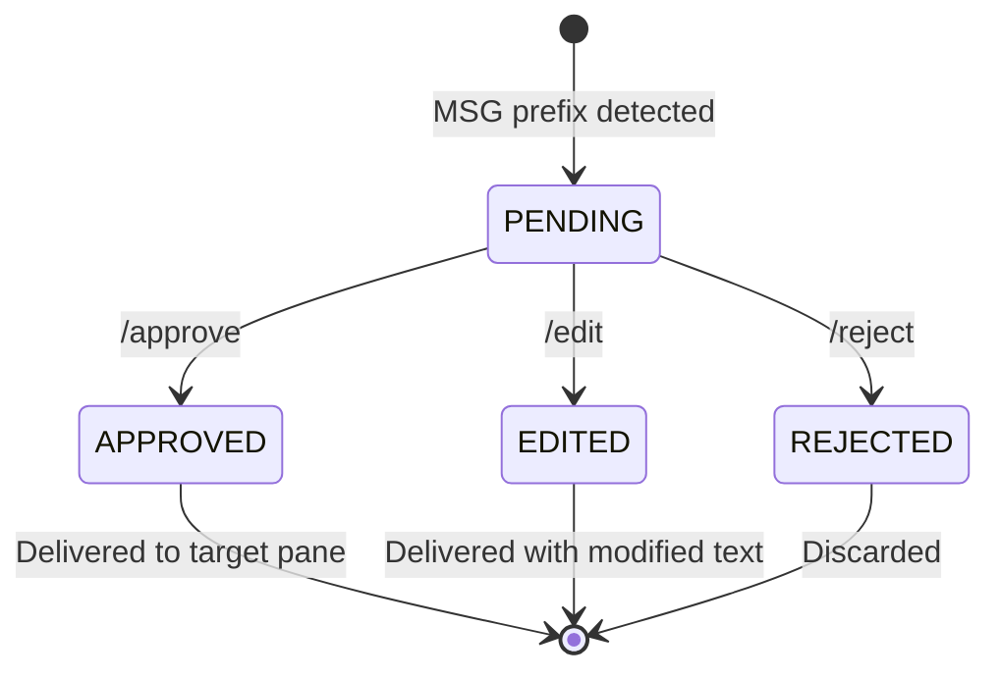

<h1 align="center">terminal-bridge-v2</h1>

<p align="center">
  <strong>Universal CLI LLM remote control + real-time monitoring + human intervention</strong>
</p>

<p align="center">
  <a href="https://opensource.org/licenses/MIT"></a>
  <a href="https://www.python.org/downloads/">= 3.9"></a>
  
  
  
</p>

<p align="center">
  <a href="#installation">Installation</a> •
  <a href="#supported-cli-tools">Supported Tools</a> •
  <a href="#quick-start">Quick Start</a> •
  <a href="#docs">Docs</a> •
  <a href="#features">Features</a> •
  <a href="#mcp-api-reference">API Reference</a> •
  <a href="#cli-reference">CLI Reference</a> •
  <a href="README.zh-TW.md">中文版</a>
</p>

---

## Overview

**tb2** orchestrates any CLI-based LLM tool from a single control plane. Connect Codex, Claude Code, Aider, Gemini, llama.cpp, or your own tool — capture output, auto-forward messages, and optionally put a human in the loop.

- **Multi-backend** — pluggable terminal backends: tmux (Linux/macOS), process/ConPTY (Windows), pipe (non-interactive)
- **Human-in-the-loop** — pending queue with approve / edit / reject before auto-forward delivery
- **MCP server** — 14-tool JSON-RPC HTTP API for full programmatic control

## Supported CLI Tools

`tb2` keeps six profiles, but these are the four first-class interactive clients the repo now treats as fully supported:

| Tool | Profile | Windows | Linux / macOS | Status |
|------|---------|---------|---------------|--------|
| OpenAI Codex CLI | `codex` | `process` | `tmux` | Fully supported |
| Claude Code CLI | `claude-code` | `process` | `tmux` | Fully supported |
| Gemini CLI | `gemini` | `process` | `tmux` | Fully supported |
| Aider | `aider` | `process` | `tmux` | Fully supported |

Other profiles remain available:

- `generic` is the fallback for unknown shell-like tools.
- `llama` remains available as a community profile for llama.cpp / Ollama-style shells.

Before your first real session, run:

```bash
python -m tb2 doctor
```

That command checks backend readiness plus whether the first-class CLI tools are actually installed on the current machine.

--- 

```mermaid
graph TD
    subgraph Backends
        TMUX[TmuxBackend<br/>Linux / macOS]
        PROC[ProcessBackend<br/>Windows ConPTY / pty]
        PIPE[PipeBackend<br/>Non-interactive]
    end

    subgraph Core
        BROKER[Broker<br/>Interactive REPL]
        SERVER[MCP Server<br/>JSON-RPC HTTP :3189]
        BRIDGE[Bridge Worker<br/>Background poller]
    end

    subgraph Services
        ROOM[Room<br/>Message buffer]
        INTERVENTION[InterventionLayer<br/>Human review queue]
        DIFF[Diff Engine<br/>Hash-based O&#40;n&#41;]
        PROFILE[ToolProfile<br/>Prompt detection]
    end

    BROKER --> TMUX
    BROKER --> PROC
    BROKER --> PIPE
    SERVER --> BRIDGE
    BRIDGE --> TMUX
    BRIDGE --> PROC
    BRIDGE --> PIPE
    BRIDGE --> ROOM
    BRIDGE --> INTERVENTION
    BRIDGE --> DIFF
    BRIDGE --> PROFILE
```

## Installation

```bash
git clone https://github.com/pingqLIN/terminal-bridge-v2.git
cd terminal-bridge-v2
pip install -e .
```

<details>
<summary>Platform-specific options</summary>

```bash
# Windows ConPTY support
pip install -e ".[windows]"

# Dev/test dependencies
pip install -e ".[dev]"
```

</details>

**Requirements:** Python >= 3.9. Linux/macOS requires `tmux` installed.

---

## Quick Start

Recommended first step:

```bash
python -m tb2 doctor
```

### Linux / macOS (tmux)

```bash
# Create session with two panes, then start broker
python3 -m tb2 init --session demo
python3 -m tb2 broker --a demo:0.0 --b demo:0.1 --profile codex --auto
```

### Windows (process backend)

```bash
python -m tb2 --backend process init --session demo
python -m tb2 --backend process broker --a demo:a --b demo:b --profile codex --auto
```

### MCP Server

```bash
python3 -m tb2 server --host 127.0.0.1 --port 3189
```

### Unified Hosting (cross-platform background service)

```bash
# Start detached service (secure default: localhost only)
python -m tb2 service start --host 127.0.0.1 --port 3189

# Status / logs / stop
python -m tb2 service status
python -m tb2 service logs --lines 120
python -m tb2 service stop
```

Common service options:

- `python -m tb2 service restart --host 127.0.0.1 --port 3189` to do rolling restart
- `python -m tb2 service start --force` to replace an existing tracked instance
- `python -m tb2 service start --python /path/to/python` to pin runtime
- `python -m tb2 service stop --timeout 12` to tune graceful shutdown wait
- set `TB2_STATE_DIR=/path/to/state` to override state/log location

### Web GUI

```bash
python -m tb2 gui --host 127.0.0.1 --port 3189
```

Open `http://127.0.0.1:3189/` in your browser.
The built-in GUI now defaults to a workflow-first model:

- `Launch Session` for Host / Guest setup
- `Run Collaboration` for room-aware operator messages
- `Human Control` for intervention approvals and interrupts
- live room streaming over `SSE`, `WebSocket`, or `room_poll`


## Docs

- [Getting Started](docs/getting-started.md)
- [AI Orchestration Guide](docs/ai-orchestration.md)
- [MCP Client Setup](docs/mcp-client-setup.md)
- [Traditional Chinese Getting Started](docs/getting-started.zh-TW.md)
- [Traditional Chinese AI Orchestration Guide](docs/ai-orchestration.zh-TW.md)

---

## Features

### Architecture



### Tool Profiles

Built-in prompt detection for popular CLI LLM tools:

| Profile | Prompt Patterns | Strip ANSI | Description |
|---------|----------------|------------|-------------|
| `generic` | `$ # >` | No | Default shell |
| `codex` | `› > $` | No | OpenAI Codex CLI |
| `claude-code` | `> claude> $` | No | Claude Code CLI |
| `aider` | `aider> >` | Yes | Aider CLI |
| `llama` | `> llama>` | No | llama.cpp / Ollama |
| `gemini` | `> gemini> ✦` | Yes | Gemini CLI |

### Human Intervention

Enable `--intervention` to queue all `MSG:` auto-forwards for human review before delivery.



**Workflow:**

1. Broker detects a `MSG:` prefixed line from pane A
2. Message enters the **PENDING** queue (visible via `/pending` or `intervention_list`)
3. Human reviews and chooses:
   - `/approve <id>` — deliver original text
   - `/edit <id> <new text>` — deliver modified text
   - `/reject <id>` — discard silently
4. `/resume` flushes all pending messages and disables the queue

### Key Internals

| Component | Description |
|-----------|-------------|
| Adaptive polling | Exponential backoff (100 ms → 3 s) when idle, instant reset on activity |
| Hash-based diff | O(n) new-line detection replacing naive O(n²) suffix matching |
| Room system | Bounded rooms with cursor polling, live subscriptions, and TTL cleanup |
| Single-call capture | Both panes captured in one subprocess invocation (tmux) |

### Live Room Transport

- `GET /rooms/{room_id}/stream` provides `text/event-stream` room events for GUI and operator tools
- `GET /ws` provides bidirectional WebSocket subscribe/post/control for advanced clients
- `room_poll` remains the compatibility fallback for scripted or low-friction clients

---

## Broker Commands

| Command | Description |
|---------|-------------|
| `/a <text>` | Send text to pane A (with Enter) |
| `/b <text>` | Send text to pane B (with Enter) |
| `/both <text>` | Send text to both panes |
| `/auto on\|off` | Toggle `MSG:` auto-forward |
| `/pause` | Enable human review queue |
| `/resume` | Disable review + deliver all pending |
| `/pending` | List pending messages with age |
| `/approve <id\|all>` | Approve and deliver message(s) |
| `/reject <id\|all>` | Reject and discard message(s) |
| `/edit <id> <text>` | Replace message text and deliver |
| `/profile [name]` | Show current profile / switch to `name` |
| `/status` | Show broker state and poll interval |
| `/help` | Print command reference |
| `/quit` | Exit broker |

Any text without a `/` prefix is sent directly to pane A.

---

## MCP API Reference

15 tools exposed via JSON-RPC over HTTP at `POST /mcp`.

**Request format:**

```json
{
  "jsonrpc": "2.0",
  "id": 1,
  "method": "tools/call",
  "params": {
    "name": "<tool_name>",
    "arguments": { }
  }
}
```

For MCP client registration (Codex, Claude, Gemini), see [`docs/mcp-client-setup.md`](docs/mcp-client-setup.md).

### Terminal Tools

#### `terminal_init`

Create a session with two panes (A and B).

| Parameter | Type | Default | Description |
|-----------|------|---------|-------------|
| `session` | string | `"tb2"` | Session name |
| `backend` | string | `"tmux"` | `tmux` / `process` / `pipe` |
| `backend_id` | string | `"default"` | Backend instance identifier |
| `shell` | string | — | Shell override (process/pipe) |
| `distro` | string | — | WSL distro (tmux only) |

**Returns:** `{ "session", "pane_a", "pane_b" }`

```bash
curl -sS http://127.0.0.1:3189/mcp -H 'content-type: application/json' \
  -d '{"jsonrpc":"2.0","id":1,"method":"tools/call","params":{"name":"terminal_init","arguments":{"session":"demo"}}}'
```

#### `terminal_capture`

Capture current screen content of a pane.

| Parameter | Type | Default | Required | Description |
|-----------|------|---------|----------|-------------|
| `target` | string | — | Yes | Pane identifier |
| `lines` | int | `200` | No | Scrollback lines |
| `backend` | string | `"tmux"` | No | Backend type |
| `backend_id` | string | `"default"` | No | Backend instance |

**Returns:** `{ "lines": [...], "count": int }`

#### `terminal_send`

Send text to a pane, optionally pressing Enter.

| Parameter | Type | Default | Required | Description |
|-----------|------|---------|----------|-------------|
| `target` | string | — | Yes | Pane identifier |
| `text` | string | — | Yes | Text to send |
| `enter` | boolean | `false` | No | Press Enter after text |
| `backend` | string | `"tmux"` | No | Backend type |
| `backend_id` | string | `"default"` | No | Backend instance |

**Returns:** `{ "ok": true }`

#### `terminal_interrupt`

Send SIGINT (Ctrl+C) to bridge pane(s).

| Parameter | Type | Default | Required | Description |
|-----------|------|---------|----------|-------------|
| `bridge_id` | string | — | Yes | Bridge to target |
| `target` | string | `"both"` | No | `a` / `b` / `both` |

**Returns:** `{ "bridge_id", "sent": [...], "errors": [...], "ok": bool }`

### Room Tools

#### `room_create`

Create a message room (idempotent).

| Parameter | Type | Default | Description |
|-----------|------|---------|-------------|
| `room_id` | string | auto-generated | Desired room ID |

**Returns:** `{ "room_id" }`

#### `room_poll`

Poll a room for new messages after a cursor.

| Parameter | Type | Default | Required | Description |
|-----------|------|---------|----------|-------------|
| `room_id` | string | — | Yes | Room to poll |
| `after_id` | int | `0` | No | Cursor — messages after this ID |
| `limit` | int | `50` | No | Max messages to return |

**Returns:** `{ "messages": [{id, author, text, kind, ts}], "latest_id" }`

#### `room_post`

Post a message to a room, optionally delivering to a bridge pane.

| Parameter | Type | Default | Required | Description |
|-----------|------|---------|----------|-------------|
| `room_id` | string | — | Yes | Target room |
| `text` | string | — | Yes | Message body |
| `author` | string | `"user"` | No | Author name |
| `kind` | string | `"chat"` | No | `chat` / `terminal` / `system` |
| `deliver` | string | — | No | `a` / `b` / `both` |
| `bridge_id` | string | — | No | Required when `deliver` is set |

**Returns:** `{ "id" }`

### Bridge Tools

#### `bridge_start`

Start a background bridge worker that polls two panes, diffs output, and posts new lines to a room.

| Parameter | Type | Default | Required | Description |
|-----------|------|---------|----------|-------------|
| `pane_a` | string | — | Yes | Pane A identifier |
| `pane_b` | string | — | Yes | Pane B identifier |
| `room_id` | string | auto-created | No | Room for messages |
| `bridge_id` | string | auto-generated | No | Custom bridge ID |
| `profile` | string | `"generic"` | No | Tool profile name |
| `poll_ms` | int | `400` | No | Base poll interval (ms) |
| `lines` | int | `200` | No | Scrollback lines per poll |
| `auto_forward` | boolean | `false` | No | Auto-forward `MSG:` lines |
| `intervention` | boolean | `false` | No | Enable human review queue |
| `backend` | string | `"tmux"` | No | Backend type |
| `backend_id` | string | `"default"` | No | Backend instance |

**Returns:** `{ "bridge_id", "room_id" }`

#### `bridge_stop`

Stop a running bridge worker.

| Parameter | Type | Required | Description |
|-----------|------|----------|-------------|
| `bridge_id` | string | Yes | Bridge ID |

**Returns:** `{ "ok": true }`

### Intervention Tools

#### `intervention_list`

List all pending messages in a bridge's intervention queue.

| Parameter | Type | Required | Description |
|-----------|------|----------|-------------|
| `bridge_id` | string | Yes | Bridge ID |

**Returns:** `{ "bridge_id", "pending": [...], "count" }`

#### `intervention_approve`

Approve and deliver pending message(s).

| Parameter | Type | Default | Required | Description |
|-----------|------|---------|----------|-------------|
| `bridge_id` | string | — | Yes | Bridge ID |
| `id` | int\|string | `"all"` | No | Message ID or `"all"` |

**Returns:** `{ "bridge_id", "approved", "delivered": [...], "errors": [...], "remaining" }`

#### `intervention_reject`

Reject and discard pending message(s).

| Parameter | Type | Default | Required | Description |
|-----------|------|---------|----------|-------------|
| `bridge_id` | string | — | Yes | Bridge ID |
| `id` | int\|string | `"all"` | No | Message ID or `"all"` |

**Returns:** `{ "bridge_id", "rejected", "remaining" }`

### Utility Tools

#### `list_profiles`

List all registered tool profile names. No parameters.

**Returns:** `{ "profiles": ["aider", "claude-code", "codex", "gemini", "generic", "llama"] }`

#### `status`

Server status snapshot. No parameters.

**Returns:** `{ "rooms": [{id, messages, age}], "bridges": [...] }`

---

## Live Room Endpoints

### `GET /rooms/{room_id}/stream`

Server-Sent Events room stream.

- query: `after_id` cursor, `limit` backlog size
- events: `ready`, `room`
- payload shape: `{ "event_id", "id", "room_id", "bridge_id", "author", "text", "kind", "meta", "created_at" }`

### `GET /ws`

WebSocket room stream and control endpoint.

- client actions: `subscribe`, `unsubscribe`, `room_post`, `intervention_list`, `intervention_approve`, `intervention_reject`, `status`
- stream events: `ready`, `subscribed`, `room_event`, `result`, `error`

---

## CLI Reference

```text
usage: python -m tb2 [--backend {tmux,process,pipe}] [--distro DISTRO] [--use-wsl]
                      {init,list,capture,send,room,broker,profiles,doctor,server,gui,service} ...
```

| Subcommand | Description | Key Arguments |
|------------|-------------|---------------|
| `init` | Create session with two panes | `--session NAME` |
| `list` | List panes in a session | `--session NAME` |
| `capture` | Capture pane output | `--target PANE` `--lines N` |
| `send` | Send text to a pane | `--target PANE` `--text TEXT` `--enter` |
| `room` | Human operator room CLI | `watch|post|pending|approve|reject` |
| `broker` | Start interactive broker REPL | `--a PANE --b PANE` `--profile NAME` `--auto` `--intervention` |
| `profiles` | List available profiles | `--verbose` |
| `doctor` | Check backends + first-class CLI compatibility | `--json` |
| `server` | Start MCP HTTP server | `--host ADDR` `--port PORT` |
| `gui` | Start built-in web GUI | `--host ADDR` `--port PORT` `--no-browser` |
| `service` | Cross-platform background hosting for `tb2 server` | `start|stop|status|restart|logs` |

---

## Testing

```bash
pip install -e ".[dev]"
pytest
```

<details>
<summary>More test commands</summary>

```bash
# Coverage report
pytest --cov=tb2 --cov-report=term-missing

# Run E2E tests (requires tmux)
pytest -m e2e

# Skip E2E tests
pytest -m "not e2e"
```

</details>

**Test coverage:** current suite collects `225` tests (`pytest --collect-only`), covering backend, process_backend, pipe_backend, broker, server, room, intervention, diff, profile, CLI, support, remote-control transport, service manager, and E2E integration.

Note: E2E tests require tmux + local socket permissions. In restricted sandbox environments, E2E may fail due environment constraints even when core unit/integration tests pass.

---

## License

[MIT License](https://opensource.org/licenses/MIT)

---

## AI-Assisted Development

This project was developed with AI assistance.

| Model | Role |
|-------|------|
| Claude Opus 4 | Primary architect and implementation |
| OpenAI Codex CLI | Code review and sub-agent contributions |

> **Disclaimer:** While the author has made every effort to review and validate the AI-generated code, no guarantee can be made regarding its correctness, security, or fitness for any particular purpose. Use at your own risk.
