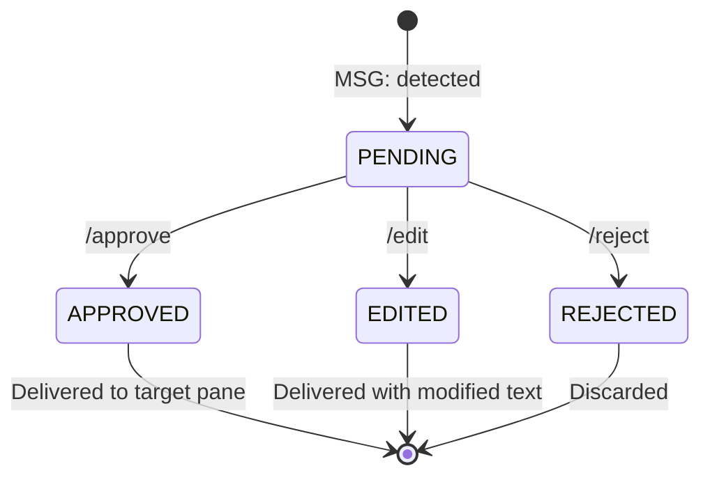
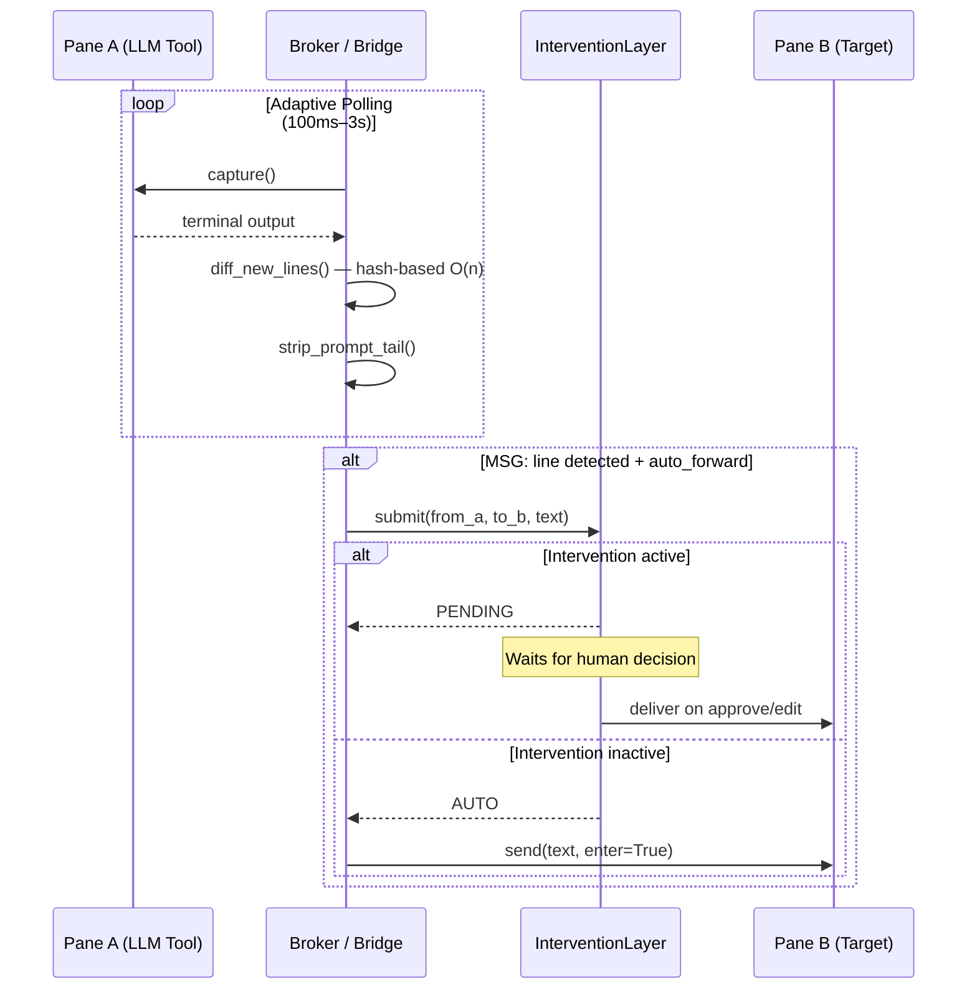
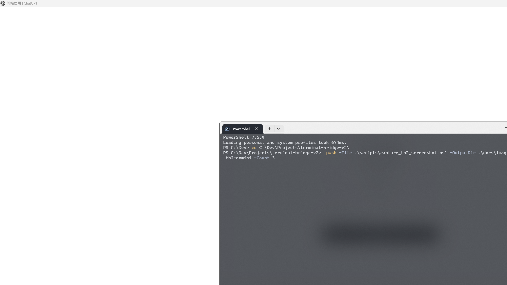
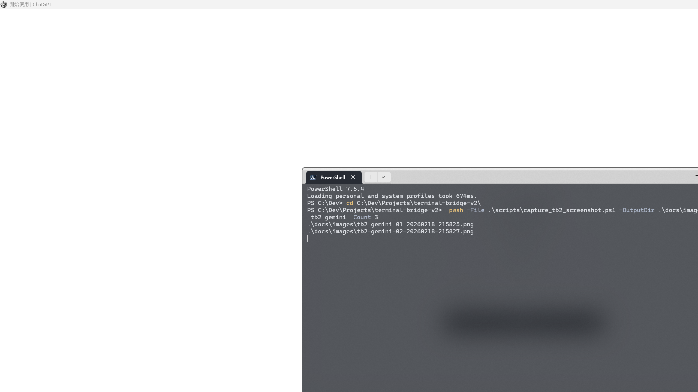

# terminal-bridge-v2

[中文版](README.zh-TW.md)

> Universal CLI LLM remote control + real-time monitoring + human intervention

**terminal-bridge-v2** (tb2) lets you orchestrate any CLI-based LLM tool — Codex, Claude Code, Aider, Gemini, llama.cpp, or your own — from a single control plane. It captures terminal output, detects new lines via hash-based diffing, auto-forwards messages between panes, and optionally puts a human in the loop before anything is delivered.

## Features

- **Backend abstraction** — pluggable terminal backends: tmux (Linux/macOS), process/ConPTY (Windows), pipe (non-interactive)
- **Tool profiles** — built-in prompt detection for Codex, Claude Code, Aider, Gemini, llama.cpp; easily extensible
- **Human intervention** — pending queue with approve / edit / reject before auto-forward
- **Adaptive polling** — exponential backoff (100 ms → 3 s) when idle, instant reset on activity
- **Efficient diff** — hash-based O(n) new-line detection replacing naive O(n²) suffix matching
- **Room system** — bounded message rooms with cursor-based polling and TTL cleanup
- **MCP server** — JSON-RPC HTTP server exposing 14 tools for programmatic control
- **Single-call capture** — both panes captured in one subprocess invocation (tmux)

## Architecture

```mermaid
graph TD
    subgraph Backends
        TMUX[TmuxBackend<br/>Linux / macOS]
        PROC[ProcessBackend<br/>Windows ConPTY / pty]
        PIPE[PipeBackend<br/>Non-interactive]
    end

    subgraph Core
        BROKER[Broker<br/>Interactive REPL]
        SERVER[MCP Server<br/>JSON-RPC HTTP :3189]
        BRIDGE[Bridge Worker<br/>Background poller]
    end

    subgraph Services
        ROOM[Room<br/>Message buffer]
        INTERVENTION[InterventionLayer<br/>Human review queue]
        DIFF[Diff Engine<br/>Hash-based O&#40;n&#41;]
        PROFILE[ToolProfile<br/>Prompt detection]
    end

    BROKER --> TMUX
    BROKER --> PROC
    BROKER --> PIPE
    SERVER --> BRIDGE
    BRIDGE --> TMUX
    BRIDGE --> PROC
    BRIDGE --> PIPE
    BRIDGE --> ROOM
    BRIDGE --> INTERVENTION
    BRIDGE --> DIFF
    BRIDGE --> PROFILE
```



## Installation

```bash
# Clone
git clone https://github.com/pingqLIN/terminal-bridge-v2.git
cd terminal-bridge-v2

# Install (editable)
pip install -e .

# With Windows ConPTY support
pip install -e ".[windows]"

# With dev/test dependencies
pip install -e ".[dev]"
```

**Requirements:** Python >= 3.9. On Linux/macOS the tmux backend requires `tmux` installed.

## Quick Start

### Linux / macOS (tmux backend)

```bash
# 1. Create a tmux session with two panes
python3 -m tb2 init --session demo

# 2. Attach to see the panes
tmux attach -t demo

# 3. Start broker with Codex profile + auto-forward
python3 -m tb2 broker --a demo:0.0 --b demo:0.1 --profile codex --auto

# 4. With human review enabled
python3 -m tb2 broker --a demo:0.0 --b demo:0.1 --profile codex --auto --intervention
```

### Windows (process backend)

```powershell
# 1. Create session (spawns two ConPTY processes)
python -m tb2 --backend process init --session demo

# 2. Start broker
python -m tb2 --backend process broker --a demo:a --b demo:b --profile codex --auto
```

### MCP Server (any platform)

```bash
# Start the JSON-RPC HTTP server
python3 -m tb2 server --host 127.0.0.1 --port 3189

# Init a session via MCP
curl -sS http://127.0.0.1:3189/mcp \
  -H 'content-type: application/json' \
  -d '{"jsonrpc":"2.0","id":1,"method":"tools/call","params":{"name":"terminal_init","arguments":{"session":"demo"}}}'

# Start a bridge with auto-forward
curl -sS http://127.0.0.1:3189/mcp \
  -H 'content-type: application/json' \
  -d '{"jsonrpc":"2.0","id":2,"method":"tools/call","params":{"name":"bridge_start","arguments":{"pane_a":"demo:0.0","pane_b":"demo:0.1","profile":"codex","auto_forward":true}}}'
```

### Pipe Backend (non-interactive tools)

```bash
# For tools that read stdin / write stdout (no PTY needed)
python3 -m tb2 --backend pipe init --session demo
python3 -m tb2 --backend pipe broker --a demo:a --b demo:b --profile generic --auto
```

## Broker Commands

The interactive broker REPL accepts these commands:

| Command              | Description                              |
| -------------------- | ---------------------------------------- |
| `/a <text>`          | Send text to pane A (with Enter)         |
| `/b <text>`          | Send text to pane B (with Enter)         |
| `/both <text>`       | Send text to both panes                  |
| `/auto on\|off`      | Toggle `MSG:` auto-forward               |
| `/pause`             | Enable human review queue                |
| `/resume`            | Disable review + deliver all pending     |
| `/pending`           | List pending messages with age           |
| `/approve <id\|all>` | Approve and deliver message(s)           |
| `/reject <id\|all>`  | Reject and discard message(s)            |
| `/edit <id> <text>`  | Replace message text and deliver         |
| `/profile [name]`    | Show current profile / switch to `name`  |
| `/status`            | Show broker state and poll interval      |
| `/help`              | Print command reference                  |
| `/quit`              | Exit broker                              |

Any text without a `/` prefix is sent directly to pane A.

## Available Profiles

| Profile        | Prompt Patterns              | Strip ANSI | Description          |
| -------------- | ---------------------------- | ---------- | -------------------- |
| `generic`      | `$ # >`                      | No         | Default shell        |
| `codex`        | `› > $`                      | No         | OpenAI Codex CLI     |
| `claude-code`  | `> claude> $`                | No         | Claude Code CLI      |
| `aider`        | `aider> >`                   | Yes        | Aider CLI            |
| `llama`        | `> llama>`                   | No         | llama.cpp / Ollama   |
| `gemini`       | `> gemini> ✦`                | Yes        | Gemini CLI           |

## Human Intervention

When `--intervention` is enabled, all `MSG:` auto-forwards are queued for human review before delivery.



**Workflow:**

1. Broker detects a `MSG:` prefixed line from pane A
2. Message enters the **PENDING** queue (visible via `/pending` or `intervention_list`)
3. Human reviews and chooses:
   - `/approve <id>` — deliver original text
   - `/edit <id> <new text>` — deliver modified text
   - `/reject <id>` — discard silently
4. `/resume` flushes all pending messages and disables the queue

## MCP API Reference

The MCP server exposes 14 tools via JSON-RPC over HTTP at `POST /mcp`.

**Request format:**

```json
{
  "jsonrpc": "2.0",
  "id": 1,
  "method": "tools/call",
  "params": {
    "name": "<tool_name>",
    "arguments": { ... }
  }
}
```

### Terminal Tools

#### `terminal_init`

Create a session with two panes (A and B).

| Parameter    | Type   | Default     | Description                    |
| ------------ | ------ | ----------- | ------------------------------ |
| `session`    | string | `"tb2"`     | Session name                   |
| `backend`    | string | `"tmux"`    | `tmux` / `process` / `pipe`   |
| `backend_id` | string | `"default"` | Backend instance identifier    |
| `shell`      | string | —           | Shell override (process/pipe)  |
| `distro`     | string | —           | WSL distro (tmux only)         |

**Returns:** `{ "session", "pane_a", "pane_b" }`

```bash
curl -sS http://127.0.0.1:3189/mcp -H 'content-type: application/json' \
  -d '{"jsonrpc":"2.0","id":1,"method":"tools/call","params":{"name":"terminal_init","arguments":{"session":"demo"}}}'
```

#### `terminal_capture`

Capture current screen content of a pane.

| Parameter    | Type   | Default     | Required | Description              |
| ------------ | ------ | ----------- | -------- | ------------------------ |
| `target`     | string | —           | Yes      | Pane identifier          |
| `lines`      | int    | `200`       | No       | Scrollback lines         |
| `backend`    | string | `"tmux"`    | No       | Backend type             |
| `backend_id` | string | `"default"` | No       | Backend instance         |

**Returns:** `{ "lines": [...], "count": int }`

```bash
curl -sS http://127.0.0.1:3189/mcp -H 'content-type: application/json' \
  -d '{"jsonrpc":"2.0","id":1,"method":"tools/call","params":{"name":"terminal_capture","arguments":{"target":"demo:0.0"}}}'
```

#### `terminal_send`

Send text to a pane, optionally pressing Enter.

| Parameter    | Type    | Default     | Required | Description            |
| ------------ | ------- | ----------- | -------- | ---------------------- |
| `target`     | string  | —           | Yes      | Pane identifier        |
| `text`       | string  | —           | Yes      | Text to send           |
| `enter`      | boolean | `false`     | No       | Press Enter after text |
| `backend`    | string  | `"tmux"`    | No       | Backend type           |
| `backend_id` | string  | `"default"` | No       | Backend instance       |

**Returns:** `{ "ok": true }`

```bash
curl -sS http://127.0.0.1:3189/mcp -H 'content-type: application/json' \
  -d '{"jsonrpc":"2.0","id":1,"method":"tools/call","params":{"name":"terminal_send","arguments":{"target":"demo:0.0","text":"echo hello","enter":true}}}'
```

#### `terminal_interrupt`

Send SIGINT (Ctrl+C) to bridge pane(s).

| Parameter    | Type   | Default  | Required | Description                              |
| ------------ | ------ | -------- | -------- | ---------------------------------------- |
| `bridge_id`  | string | —        | Yes      | Bridge to target                         |
| `target`     | string | `"both"` | No       | `a` / `b` / `both` / specific pane id   |

**Returns:** `{ "bridge_id", "sent": [...], "errors": [...], "ok": bool }`

### Room Tools

#### `room_create`

Create a message room (idempotent).

| Parameter | Type   | Default      | Description                     |
| --------- | ------ | ------------ | ------------------------------- |
| `room_id` | string | auto-generated | Desired room ID               |

**Returns:** `{ "room_id" }`

#### `room_poll`

Poll a room for new messages after a cursor.

| Parameter  | Type   | Default | Required | Description                    |
| ---------- | ------ | ------- | -------- | ------------------------------ |
| `room_id`  | string | —       | Yes      | Room to poll                   |
| `after_id` | int    | `0`     | No       | Cursor — messages after this ID |
| `limit`    | int    | `50`    | No       | Max messages to return         |

**Returns:** `{ "messages": [{id, author, text, kind, ts}], "latest_id" }`

#### `room_post`

Post a message to a room, optionally delivering to a bridge pane.

| Parameter    | Type   | Default  | Required | Description                     |
| ------------ | ------ | -------- | -------- | ------------------------------- |
| `room_id`    | string | —        | Yes      | Target room                     |
| `text`       | string | —        | Yes      | Message body                    |
| `author`     | string | `"user"` | No       | Author name                     |
| `kind`       | string | `"chat"` | No       | `chat` / `terminal` / `system`  |
| `deliver`    | string | —        | No       | `a` / `b` / `both` — also send to pane |
| `bridge_id`  | string | —        | No       | Required when `deliver` is set  |

**Returns:** `{ "id" }`

### Bridge Tools

#### `bridge_start`

Start a background bridge worker that polls two panes, diffs output, and posts new lines to a room.

| Parameter       | Type    | Default     | Required | Description                    |
| --------------- | ------- | ----------- | -------- | ------------------------------ |
| `pane_a`        | string  | —           | Yes      | Pane A identifier              |
| `pane_b`        | string  | —           | Yes      | Pane B identifier              |
| `room_id`       | string  | auto-created | No      | Room for messages              |
| `bridge_id`     | string  | auto-generated | No   | Custom bridge ID               |
| `profile`       | string  | `"generic"` | No       | Tool profile name              |
| `poll_ms`       | int     | `400`       | No       | Base poll interval (ms)        |
| `lines`         | int     | `200`       | No       | Scrollback lines per poll      |
| `auto_forward`  | boolean | `false`     | No       | Auto-forward `MSG:` lines      |
| `intervention`  | boolean | `false`     | No       | Enable human review queue      |
| `backend`       | string  | `"tmux"`    | No       | Backend type                   |
| `backend_id`    | string  | `"default"` | No       | Backend instance               |

**Returns:** `{ "bridge_id", "room_id" }`

```bash
curl -sS http://127.0.0.1:3189/mcp -H 'content-type: application/json' \
  -d '{"jsonrpc":"2.0","id":1,"method":"tools/call","params":{"name":"bridge_start","arguments":{"pane_a":"demo:0.0","pane_b":"demo:0.1","profile":"codex","auto_forward":true,"intervention":true}}}'
```

#### `bridge_stop`

Stop a running bridge worker.

| Parameter    | Type   | Required | Description |
| ------------ | ------ | -------- | ----------- |
| `bridge_id`  | string | Yes      | Bridge ID   |

**Returns:** `{ "ok": true }`

### Intervention Tools

#### `intervention_list`

List all pending messages in a bridge's intervention queue.

| Parameter    | Type   | Required | Description |
| ------------ | ------ | -------- | ----------- |
| `bridge_id`  | string | Yes      | Bridge ID   |

**Returns:** `{ "bridge_id", "pending": [{id, from_pane, to_pane, text, action, edited_text, created_at}], "count" }`

#### `intervention_approve`

Approve and deliver pending message(s).

| Parameter    | Type         | Default | Required | Description                 |
| ------------ | ------------ | ------- | -------- | --------------------------- |
| `bridge_id`  | string       | —       | Yes      | Bridge ID                   |
| `id`         | int\|string  | `"all"` | No       | Message ID or `"all"`       |

**Returns:** `{ "bridge_id", "approved", "delivered": [{id, to_pane}], "errors": [...], "remaining" }`

#### `intervention_reject`

Reject and discard pending message(s).

| Parameter    | Type         | Default | Required | Description                 |
| ------------ | ------------ | ------- | -------- | --------------------------- |
| `bridge_id`  | string       | —       | Yes      | Bridge ID                   |
| `id`         | int\|string  | `"all"` | No       | Message ID or `"all"`       |

**Returns:** `{ "bridge_id", "rejected", "remaining" }`

### Utility Tools

#### `list_profiles`

List all registered tool profile names. No parameters.

**Returns:** `{ "profiles": ["aider", "claude-code", "codex", "gemini", "generic", "llama"] }`

#### `status`

Server status snapshot. No parameters.

**Returns:** `{ "rooms": [{id, messages, age}], "bridges": [...] }`

## Data Flow



## CLI Reference

```
usage: python -m tb2 [--backend {tmux,process,pipe}] [--distro DISTRO] [--use-wsl]
                      {init,list,capture,send,broker,profiles,server} ...
```

| Subcommand  | Description                         | Key Arguments                                        |
| ----------- | ----------------------------------- | ---------------------------------------------------- |
| `init`      | Create session with two panes       | `--session NAME`                                     |
| `list`      | List panes in a session             | `--session NAME`                                     |
| `capture`   | Capture pane output                 | `--target PANE` `--lines N`                          |
| `send`      | Send text to a pane                 | `--target PANE` `--text TEXT` `--enter`               |
| `broker`    | Start interactive broker REPL       | `--a PANE --b PANE` `--profile NAME` `--auto` `--intervention` |
| `profiles`  | List available profiles             | —                                                    |
| `server`    | Start MCP HTTP server               | `--host ADDR` `--port PORT`                          |

## Testing

```bash
# Install dev dependencies
pip install -e ".[dev]"

# Run unit tests (162 tests)
pytest

# Run with coverage
pytest --cov=tb2 --cov-report=term-missing

# Run E2E tests (requires tmux)
pytest -m e2e

# Skip E2E tests
pytest -m "not e2e"
```

**Test coverage:** 162 tests covering all modules — backend, process_backend, pipe_backend, broker, server, room, intervention, diff, profile, CLI, and E2E integration.

## Runtime Screenshots





## License

[MIT License](https://opensource.org/licenses/MIT)

## AI-Assisted Development

This project was developed with AI assistance.

| Model | Role |
| ----- | ---- |
| Claude Opus 4 | Primary architect and implementation |
| OpenAI Codex CLI | Code review and sub-agent contributions |

> **Disclaimer:** While the author has made every effort to review and validate the AI-generated code, no guarantee can be made regarding its correctness, security, or fitness for any particular purpose. Use at your own risk.
