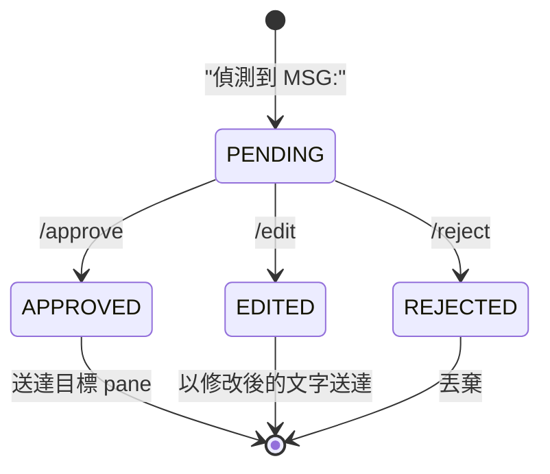
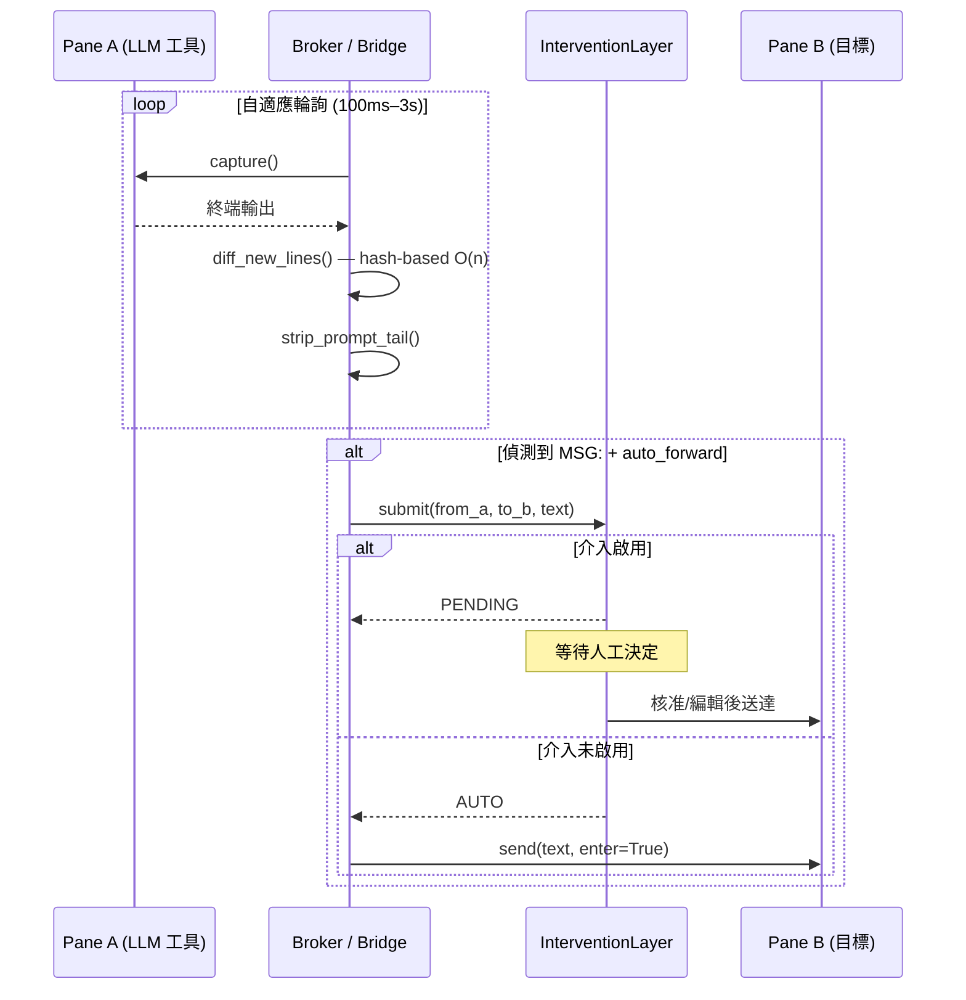
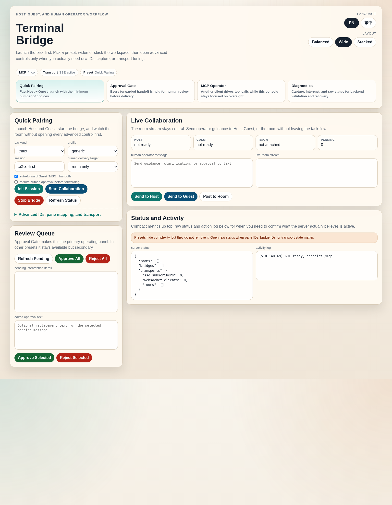

# terminal-bridge-v2

[English](README.md)

> 通用 CLI LLM 遙控 + 即時監控 + 人工介入

**terminal-bridge-v2**（tb2）讓你從單一控制面板操控任何 CLI LLM 工具 — Codex、Claude Code、Aider、Gemini、llama.cpp 或自訂工具。它擷取終端輸出、透過 hash 差異比對偵測新行、自動在 pane 之間轉發訊息，並可選擇性地讓人工在訊息送達前進行審查。

## 功能特色

- **後端抽象** — 可插拔的終端後端：tmux（Linux/macOS）、process/ConPTY（Windows）、pipe（非互動式）
- **工具設定檔** — 內建 Codex、Claude Code、Aider、Gemini、llama.cpp 的提示偵測；易於擴充
- **人工介入** — 待審佇列，支援核准 / 編輯 / 拒絕後再轉發
- **自適應輪詢** — 閒置時指數退避（100 ms → 3 s），偵測到活動時立即重置
- **高效差異比對** — 基於 hash 的 O(n) 新行偵測，取代原始 O(n²) 後綴比對
- **Room 系統** — 有容量限制的訊息房間，支援 cursor-based 輪詢與 TTL 清理
- **MCP 伺服器** — JSON-RPC HTTP 伺服器，提供 14 個工具供程式化控制
- **單次擷取** — 一次 subprocess 呼叫同時擷取兩個 pane（tmux）

## 架構

```mermaid
graph TD
    subgraph 後端
        TMUX[TmuxBackend<br/>Linux / macOS]
        PROC[ProcessBackend<br/>Windows ConPTY / pty]
        PIPE[PipeBackend<br/>非互動式]
    end

    subgraph 核心
        BROKER[Broker<br/>互動式 REPL]
        SERVER[MCP Server<br/>JSON-RPC HTTP :3189]
        BRIDGE[Bridge Worker<br/>背景輪詢器]
    end

    subgraph 服務
        ROOM[Room<br/>訊息緩衝區]
        INTERVENTION[InterventionLayer<br/>人工審查佇列]
        DIFF[Diff Engine<br/>Hash-based O&#40;n&#41;]
        PROFILE[ToolProfile<br/>提示偵測]
    end

    BROKER --> TMUX
    BROKER --> PROC
    BROKER --> PIPE
    SERVER --> BRIDGE
    BRIDGE --> TMUX
    BRIDGE --> PROC
    BRIDGE --> PIPE
    BRIDGE --> ROOM
    BRIDGE --> INTERVENTION
    BRIDGE --> DIFF
    BRIDGE --> PROFILE
```



## 安裝

```bash
# 複製
git clone https://github.com/pingqLIN/terminal-bridge-v2.git
cd terminal-bridge-v2

# 安裝（可編輯模式）
pip install -e .

# 含 Windows ConPTY 支援
pip install -e ".[windows]"

# 含開發/測試依賴
pip install -e ".[dev]"
```

**需求：** Python >= 3.9。Linux/macOS 的 tmux 後端需要安裝 `tmux`。

## 快速開始

### Linux / macOS（tmux 後端）

```bash
# 1. 建立含兩個 pane 的 tmux session
python3 -m tb2 init --session demo

# 2. 附加以查看 pane
tmux attach -t demo

# 3. 使用 Codex profile + 自動轉發啟動 broker
python3 -m tb2 broker --a demo:0.0 --b demo:0.1 --profile codex --auto

# 4. 啟用人工審查模式
python3 -m tb2 broker --a demo:0.0 --b demo:0.1 --profile codex --auto --intervention
```

### Windows（process 後端）

```powershell
# 1. 建立 session（啟動兩個 ConPTY 程序）
python -m tb2 --backend process init --session demo

# 2. 啟動 broker
python -m tb2 --backend process broker --a demo:a --b demo:b --profile codex --auto
```

### MCP 伺服器（任何平台）

```bash
# 啟動 JSON-RPC HTTP 伺服器
python3 -m tb2 server --host 127.0.0.1 --port 3189

# 透過 MCP 初始化 session
curl -sS http://127.0.0.1:3189/mcp \
  -H 'content-type: application/json' \
  -d '{"jsonrpc":"2.0","id":1,"method":"tools/call","params":{"name":"terminal_init","arguments":{"session":"demo"}}}'

# 啟動含自動轉發的 bridge
curl -sS http://127.0.0.1:3189/mcp \
  -H 'content-type: application/json' \
  -d '{"jsonrpc":"2.0","id":2,"method":"tools/call","params":{"name":"bridge_start","arguments":{"pane_a":"demo:0.0","pane_b":"demo:0.1","profile":"codex","auto_forward":true}}}'
```

### Pipe 後端（非互動式工具）

```bash
# 適用於讀取 stdin / 寫入 stdout 的工具（不需要 PTY）
python3 -m tb2 --backend pipe init --session demo
python3 -m tb2 --backend pipe broker --a demo:a --b demo:b --profile generic --auto
```

## Broker 指令

互動式 broker REPL 接受以下指令：

| 指令                 | 說明                           |
| -------------------- | ------------------------------ |
| `/a <文字>`          | 發送文字到 pane A（含 Enter）  |
| `/b <文字>`          | 發送文字到 pane B（含 Enter）  |
| `/both <文字>`       | 同時發送到兩個 pane            |
| `/auto on\|off`      | 切換 `MSG:` 自動轉發          |
| `/pause`             | 啟用人工審查佇列               |
| `/resume`            | 停用審查 + 放行所有待審訊息    |
| `/pending`           | 列出待審訊息及等待時間         |
| `/approve <id\|all>` | 核准並送出訊息                 |
| `/reject <id\|all>`  | 拒絕並丟棄訊息                 |
| `/edit <id> <文字>`  | 替換訊息內容後送出             |
| `/profile [名稱]`    | 顯示目前 profile / 切換       |
| `/status`            | 顯示 broker 狀態及輪詢間隔    |
| `/help`              | 列印指令參考                   |
| `/quit`              | 結束 broker                    |

未加 `/` 前綴的文字會直接發送到 pane A。

## 可用 Profile

| Profile        | 提示模式              | 移除 ANSI | 說明               |
| -------------- | --------------------- | --------- | ------------------ |
| `generic`      | `$ # >`               | 否        | 預設 shell         |
| `codex`        | `› > $`               | 否        | OpenAI Codex CLI   |
| `claude-code`  | `> claude> $`          | 否        | Claude Code CLI    |
| `aider`        | `aider> >`            | 是        | Aider CLI          |
| `llama`        | `> llama>`            | 否        | llama.cpp / Ollama |
| `gemini`       | `> gemini> ✦`         | 是        | Gemini CLI         |

## 人工介入

啟用 `--intervention` 時，所有 `MSG:` 自動轉發都會進入佇列等待人工審查後才送達。



**流程：**

1. Broker 偵測到 pane A 的 `MSG:` 前綴行
2. 訊息進入 **PENDING** 佇列（可透過 `/pending` 或 `intervention_list` 查看）
3. 人工審查並選擇：
   - `/approve <id>` — 送出原始文字
   - `/edit <id> <新文字>` — 送出修改後的文字
   - `/reject <id>` — 靜默丟棄
4. `/resume` 放行所有待審訊息並停用佇列

## MCP API 參考

MCP 伺服器透過 `POST /mcp` 的 JSON-RPC 提供 14 個工具。

**請求格式：**

```json
{
  "jsonrpc": "2.0",
  "id": 1,
  "method": "tools/call",
  "params": {
    "name": "<工具名稱>",
    "arguments": { ... }
  }
}
```

### 終端工具

#### `terminal_init`

建立含兩個 pane（A 和 B）的 session。

| 參數         | 型別   | 預設值      | 說明                         |
| ------------ | ------ | ----------- | ---------------------------- |
| `session`    | string | `"tb2"`     | Session 名稱                 |
| `backend`    | string | `"tmux"`    | `tmux` / `process` / `pipe`  |
| `backend_id` | string | `"default"` | 後端實例識別碼               |
| `shell`      | string | —           | Shell 覆寫（process/pipe）   |
| `distro`     | string | —           | WSL 發行版（僅 tmux）        |

**回傳：** `{ "session", "pane_a", "pane_b" }`

```bash
curl -sS http://127.0.0.1:3189/mcp -H 'content-type: application/json' \
  -d '{"jsonrpc":"2.0","id":1,"method":"tools/call","params":{"name":"terminal_init","arguments":{"session":"demo"}}}'
```

#### `terminal_capture`

擷取 pane 的目前畫面內容。

| 參數         | 型別   | 預設值      | 必填 | 說明               |
| ------------ | ------ | ----------- | ---- | ------------------ |
| `target`     | string | —           | 是   | Pane 識別碼        |
| `lines`      | int    | `200`       | 否   | 回捲行數           |
| `backend`    | string | `"tmux"`    | 否   | 後端類型           |
| `backend_id` | string | `"default"` | 否   | 後端實例           |

**回傳：** `{ "lines": [...], "count": int }`

```bash
curl -sS http://127.0.0.1:3189/mcp -H 'content-type: application/json' \
  -d '{"jsonrpc":"2.0","id":1,"method":"tools/call","params":{"name":"terminal_capture","arguments":{"target":"demo:0.0"}}}'
```

#### `terminal_send`

發送文字到 pane，可選擇按 Enter。

| 參數         | 型別    | 預設值      | 必填 | 說明               |
| ------------ | ------- | ----------- | ---- | ------------------ |
| `target`     | string  | —           | 是   | Pane 識別碼        |
| `text`       | string  | —           | 是   | 要發送的文字       |
| `enter`      | boolean | `false`     | 否   | 文字後按 Enter     |
| `backend`    | string  | `"tmux"`    | 否   | 後端類型           |
| `backend_id` | string  | `"default"` | 否   | 後端實例           |

**回傳：** `{ "ok": true }`

```bash
curl -sS http://127.0.0.1:3189/mcp -H 'content-type: application/json' \
  -d '{"jsonrpc":"2.0","id":1,"method":"tools/call","params":{"name":"terminal_send","arguments":{"target":"demo:0.0","text":"echo hello","enter":true}}}'
```

#### `terminal_interrupt`

對 bridge pane 發送 SIGINT（Ctrl+C）。

| 參數         | 型別   | 預設值   | 必填 | 說明                               |
| ------------ | ------ | -------- | ---- | ---------------------------------- |
| `bridge_id`  | string | —        | 是   | 目標 bridge                        |
| `target`     | string | `"both"` | 否   | `a` / `b` / `both` / 特定 pane id |

**回傳：** `{ "bridge_id", "sent": [...], "errors": [...], "ok": bool }`

### Room 工具

#### `room_create`

建立訊息房間（冪等操作）。

| 參數      | 型別   | 預設值     | 說明            |
| --------- | ------ | ---------- | --------------- |
| `room_id` | string | 自動產生   | 指定的房間 ID   |

**回傳：** `{ "room_id" }`

#### `room_poll`

輪詢房間中 cursor 之後的新訊息。

| 參數       | 型別   | 預設值 | 必填 | 說明                    |
| ---------- | ------ | ------ | ---- | ----------------------- |
| `room_id`  | string | —      | 是   | 要輪詢的房間            |
| `after_id` | int    | `0`    | 否   | Cursor — 此 ID 之後的訊息 |
| `limit`    | int    | `50`   | 否   | 最大回傳筆數            |

**回傳：** `{ "messages": [{id, author, text, kind, ts}], "latest_id" }`

#### `room_post`

發佈訊息到房間，可選擇同時送達 bridge pane。

| 參數         | 型別   | 預設值   | 必填 | 說明                           |
| ------------ | ------ | -------- | ---- | ------------------------------ |
| `room_id`    | string | —        | 是   | 目標房間                       |
| `text`       | string | —        | 是   | 訊息內容                       |
| `author`     | string | `"user"` | 否   | 作者名稱                       |
| `kind`       | string | `"chat"` | 否   | `chat` / `terminal` / `system` |
| `deliver`    | string | —        | 否   | `a` / `b` / `both` — 同時送到 pane |
| `bridge_id`  | string | —        | 否   | 設定 `deliver` 時必填          |

**回傳：** `{ "id" }`

### Bridge 工具

#### `bridge_start`

啟動背景 bridge worker，輪詢兩個 pane、比對差異、將新行發佈到房間。

| 參數            | 型別    | 預設值      | 必填 | 說明                    |
| --------------- | ------- | ----------- | ---- | ----------------------- |
| `pane_a`        | string  | —           | 是   | Pane A 識別碼           |
| `pane_b`        | string  | —           | 是   | Pane B 識別碼           |
| `room_id`       | string  | 自動建立    | 否   | 訊息房間                |
| `bridge_id`     | string  | 自動產生    | 否   | 自訂 bridge ID          |
| `profile`       | string  | `"generic"` | 否   | 工具 profile 名稱       |
| `poll_ms`       | int     | `400`       | 否   | 基礎輪詢間隔（ms）      |
| `lines`         | int     | `200`       | 否   | 每次輪詢的回捲行數      |
| `auto_forward`  | boolean | `false`     | 否   | 自動轉發 `MSG:` 行      |
| `intervention`  | boolean | `false`     | 否   | 啟用人工審查佇列        |
| `backend`       | string  | `"tmux"`    | 否   | 後端類型                |
| `backend_id`    | string  | `"default"` | 否   | 後端實例                |

**回傳：** `{ "bridge_id", "room_id" }`

```bash
curl -sS http://127.0.0.1:3189/mcp -H 'content-type: application/json' \
  -d '{"jsonrpc":"2.0","id":1,"method":"tools/call","params":{"name":"bridge_start","arguments":{"pane_a":"demo:0.0","pane_b":"demo:0.1","profile":"codex","auto_forward":true,"intervention":true}}}'
```

#### `bridge_stop`

停止運行中的 bridge worker。

| 參數         | 型別   | 必填 | 說明       |
| ------------ | ------ | ---- | ---------- |
| `bridge_id`  | string | 是   | Bridge ID  |

**回傳：** `{ "ok": true }`

### 介入工具

#### `intervention_list`

列出 bridge 介入佇列中的所有待審訊息。

| 參數         | 型別   | 必填 | 說明       |
| ------------ | ------ | ---- | ---------- |
| `bridge_id`  | string | 是   | Bridge ID  |

**回傳：** `{ "bridge_id", "pending": [{id, from_pane, to_pane, text, action, edited_text, created_at}], "count" }`

#### `intervention_approve`

核准並送達待審訊息。

| 參數         | 型別         | 預設值  | 必填 | 說明                    |
| ------------ | ------------ | ------- | ---- | ----------------------- |
| `bridge_id`  | string       | —       | 是   | Bridge ID               |
| `id`         | int\|string  | `"all"` | 否   | 訊息 ID 或 `"all"`      |

**回傳：** `{ "bridge_id", "approved", "delivered": [{id, to_pane}], "errors": [...], "remaining" }`

#### `intervention_reject`

拒絕並丟棄待審訊息。

| 參數         | 型別         | 預設值  | 必填 | 說明                    |
| ------------ | ------------ | ------- | ---- | ----------------------- |
| `bridge_id`  | string       | —       | 是   | Bridge ID               |
| `id`         | int\|string  | `"all"` | 否   | 訊息 ID 或 `"all"`      |

**回傳：** `{ "bridge_id", "rejected", "remaining" }`

### 工具列表

#### `list_profiles`

列出所有已註冊的工具 profile 名稱。無參數。

**回傳：** `{ "profiles": ["aider", "claude-code", "codex", "gemini", "generic", "llama"] }`

#### `status`

伺服器狀態快照。無參數。

**回傳：** `{ "rooms": [{id, messages, age}], "bridges": [...] }`

## 資料流



## CLI 參考

```
usage: python -m tb2 [--backend {tmux,process,pipe}] [--distro DISTRO] [--use-wsl]
                      {init,list,capture,send,broker,profiles,server} ...
```

| 子指令      | 說明                        | 主要參數                                              |
| ----------- | --------------------------- | ----------------------------------------------------- |
| `init`      | 建立含兩個 pane 的 session  | `--session NAME`                                      |
| `list`      | 列出 session 中的 pane      | `--session NAME`                                      |
| `capture`   | 擷取 pane 輸出              | `--target PANE` `--lines N`                           |
| `send`      | 發送文字到 pane             | `--target PANE` `--text TEXT` `--enter`                |
| `broker`    | 啟動互動式 broker REPL      | `--a PANE --b PANE` `--profile NAME` `--auto` `--intervention` |
| `profiles`  | 列出可用 profile            | —                                                     |
| `server`    | 啟動 MCP HTTP 伺服器        | `--host ADDR` `--port PORT`                           |

## 測試

```bash
# 安裝開發依賴
pip install -e ".[dev]"

# 執行單元測試（162 個測試）
pytest

# 含覆蓋率
pytest --cov=tb2 --cov-report=term-missing

# 執行 E2E 測試（需要 tmux）
pytest -m e2e

# 略過 E2E 測試
pytest -m "not e2e"
```

**測試覆蓋率：** 162 個測試涵蓋所有模組 — backend、process_backend、pipe_backend、broker、server、room、intervention、diff、profile、CLI 及 E2E 整合。

## WEB 版控制台預覽

> 🚧 下次更新即將上線 — 瀏覽器版控制面板，無需 CLI 即可管理 session、bridge 與 room。



## 執行畫面


## 授權

[MIT License](https://opensource.org/licenses/MIT)

## AI 輔助開發

本專案由 AI 輔助開發。

| 模型 | 角色 |
| ---- | ---- |
| Claude Opus 4 | 主要架構設計與實作 |
| OpenAI Codex CLI | 程式碼審查與子代理人貢獻 |

> **免責聲明：** 儘管作者已盡力審查和驗證 AI 產生的程式碼，但無法保證其正確性、安全性或適用於任何特定用途。使用風險自負。
