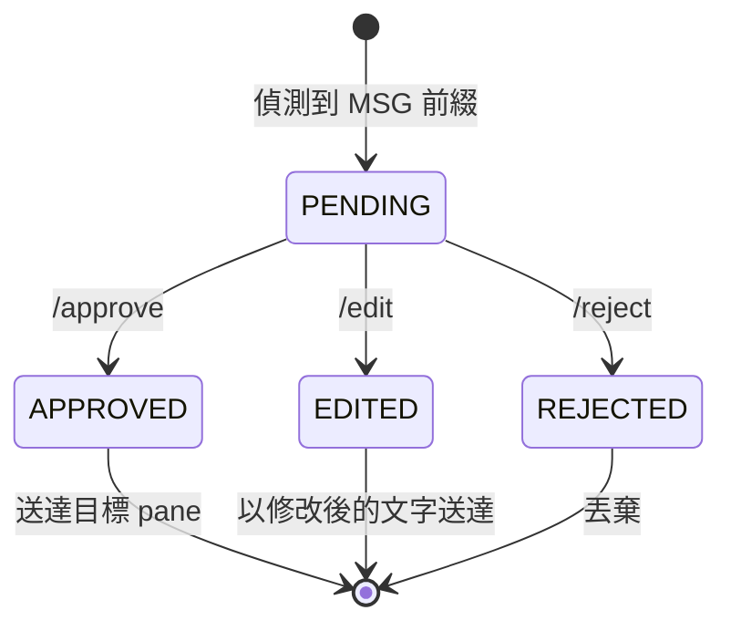

<h1 align="center">terminal-bridge-v2</h1>

<p align="center">
  <strong>通用 CLI LLM 遙控 + 即時監控 + 人工介入</strong>
</p>

<p align="center">
  <a href="https://opensource.org/licenses/MIT"></a>
  <a href="https://www.python.org/downloads/">= 3.9"></a>
  
  
  
</p>

<p align="center">
  <a href="#安裝">安裝</a> •
  <a href="#快速開始">快速開始</a> •
  <a href="#功能特色">功能特色</a> •
  <a href="#mcp-api-參考">API 參考</a> •
  <a href="#cli-參考">CLI 參考</a> •
  <a href="README.md">English</a>
</p>

---

## 概述

**tb2** 從單一控制面板操控任何 CLI LLM 工具。連接 Codex、Claude Code、Aider、Gemini、llama.cpp 或自訂工具 — 擷取輸出、自動轉發訊息，並可選擇在送達前加入人工審查。

- **多後端** — 可插拔的終端後端：tmux（Linux/macOS）、process/ConPTY（Windows）、pipe（非互動式）
- **人工介入** — 待審佇列，支援核准 / 編輯 / 拒絕後再轉發
- **MCP 伺服器** — 14 個工具的 JSON-RPC HTTP API，完整程式化控制

---

```mermaid
graph TD
    subgraph 後端
        TMUX[TmuxBackend<br/>Linux / macOS]
        PROC[ProcessBackend<br/>Windows ConPTY / pty]
        PIPE[PipeBackend<br/>非互動式]
    end

    subgraph 核心
        BROKER[Broker<br/>互動式 REPL]
        SERVER[MCP Server<br/>JSON-RPC HTTP :3189]
        BRIDGE[Bridge Worker<br/>背景輪詢器]
    end

    subgraph 服務
        ROOM[Room<br/>訊息緩衝區]
        INTERVENTION[InterventionLayer<br/>人工審查佇列]
        DIFF[Diff Engine<br/>Hash-based O&#40;n&#41;]
        PROFILE[ToolProfile<br/>提示偵測]
    end

    BROKER --> TMUX
    BROKER --> PROC
    BROKER --> PIPE
    SERVER --> BRIDGE
    BRIDGE --> TMUX
    BRIDGE --> PROC
    BRIDGE --> PIPE
    BRIDGE --> ROOM
    BRIDGE --> INTERVENTION
    BRIDGE --> DIFF
    BRIDGE --> PROFILE
```

## 安裝

```bash
git clone https://github.com/pingqLIN/terminal-bridge-v2.git
cd terminal-bridge-v2
pip install -e .
```

<details>
<summary>平台特定選項</summary>

```bash
# Windows ConPTY 支援
pip install -e ".[windows]"

# 開發/測試依賴
pip install -e ".[dev]"
```

</details>

**需求：** Python >= 3.9。Linux/macOS 需要安裝 `tmux`。

---

## 快速開始

### Linux / macOS（tmux）

```bash
# 建立含兩個 pane 的 session，啟動 broker
python3 -m tb2 init --session demo
python3 -m tb2 broker --a demo:0.0 --b demo:0.1 --profile codex --auto
```

### Windows（process 後端）

```bash
python -m tb2 --backend process init --session demo
python -m tb2 --backend process broker --a demo:a --b demo:b --profile codex --auto
```

### MCP 伺服器

```bash
python3 -m tb2 server --host 127.0.0.1 --port 3189
```

### 統一託管（跨平台背景服務）

```bash
# 啟動背景服務（安全預設: 127.0.0.1）
python -m tb2 service start --host 127.0.0.1 --port 3189

# 查狀態 / 看日誌 / 停止
python -m tb2 service status
python -m tb2 service logs --lines 120
python -m tb2 service stop
```

常用託管選項：

- `python -m tb2 service restart --host 127.0.0.1 --port 3189` 可無縫重啟
- `python -m tb2 service start --force` 可強制替換已追蹤的舊實例
- `python -m tb2 service start --python /path/to/python` 可固定 Python 執行環境
- `python -m tb2 service stop --timeout 12` 可調整優雅停機等待秒數
- 設定 `TB2_STATE_DIR=/path/to/state` 可覆寫 state/log 存放路徑

### Web GUI

```bash
python -m tb2 gui --host 127.0.0.1 --port 3189
```

開啟 `http://127.0.0.1:3189/`。


---

## 功能特色

### 架構



### 工具 Profile

內建主流 CLI LLM 工具的提示偵測：

| Profile | 提示模式 | 移除 ANSI | 說明 |
|---------|---------|-----------|------|
| `generic` | `$ # >` | 否 | 預設 shell |
| `codex` | `› > $` | 否 | OpenAI Codex CLI |
| `claude-code` | `> claude> $` | 否 | Claude Code CLI |
| `aider` | `aider> >` | 是 | Aider CLI |
| `llama` | `> llama>` | 否 | llama.cpp / Ollama |
| `gemini` | `> gemini> ✦` | 是 | Gemini CLI |

### 人工介入

啟用 `--intervention` 後，所有 `MSG:` 自動轉發都會進入佇列等待人工審查。



**流程：**

1. Broker 偵測到 pane A 的 `MSG:` 前綴行
2. 訊息進入 **PENDING** 佇列（可透過 `/pending` 或 `intervention_list` 查看）
3. 人工審查並選擇：
   - `/approve <id>` — 送出原始文字
   - `/edit <id> <新文字>` — 送出修改後的文字
   - `/reject <id>` — 靜默丟棄
4. `/resume` 放行所有待審訊息並停用佇列

### 核心機制

| 元件 | 說明 |
|------|------|
| 自適應輪詢 | 閒置時指數退避（100 ms → 3 s），偵測到活動時立即重置 |
| Hash 差異比對 | O(n) 新行偵測，取代原始 O(n²) 後綴比對 |
| Room 系統 | 有容量限制的訊息房間，cursor-based 輪詢與 TTL 清理 |
| 單次擷取 | 一次 subprocess 呼叫同時擷取兩個 pane（tmux） |

---

## Broker 指令

| 指令 | 說明 |
|------|------|
| `/a <文字>` | 發送文字到 pane A（含 Enter） |
| `/b <文字>` | 發送文字到 pane B（含 Enter） |
| `/both <文字>` | 同時發送到兩個 pane |
| `/auto on\|off` | 切換 `MSG:` 自動轉發 |
| `/pause` | 啟用人工審查佇列 |
| `/resume` | 停用審查 + 放行所有待審訊息 |
| `/pending` | 列出待審訊息及等待時間 |
| `/approve <id\|all>` | 核准並送出訊息 |
| `/reject <id\|all>` | 拒絕並丟棄訊息 |
| `/edit <id> <文字>` | 替換訊息內容後送出 |
| `/profile [名稱]` | 顯示目前 profile / 切換 |
| `/status` | 顯示 broker 狀態及輪詢間隔 |
| `/help` | 列印指令參考 |
| `/quit` | 結束 broker |

未加 `/` 前綴的文字會直接發送到 pane A。

---

## MCP API 參考

透過 `POST /mcp` 的 JSON-RPC 提供 14 個工具。

**請求格式：**

```json
{
  "jsonrpc": "2.0",
  "id": 1,
  "method": "tools/call",
  "params": {
    "name": "<工具名稱>",
    "arguments": { }
  }
}
```

MCP 客戶端註冊（Codex、Claude、Gemini）請參考 [`docs/mcp-client-setup.zh-TW.md`](docs/mcp-client-setup.zh-TW.md)。

### 終端工具

#### `terminal_init`

建立含兩個 pane（A 和 B）的 session。

| 參數 | 型別 | 預設值 | 說明 |
|------|------|--------|------|
| `session` | string | `"tb2"` | Session 名稱 |
| `backend` | string | `"tmux"` | `tmux` / `process` / `pipe` |
| `backend_id` | string | `"default"` | 後端實例識別碼 |
| `shell` | string | — | Shell 覆寫（process/pipe） |
| `distro` | string | — | WSL 發行版（僅 tmux） |

**回傳：** `{ "session", "pane_a", "pane_b" }`

```bash
curl -sS http://127.0.0.1:3189/mcp -H 'content-type: application/json' \
  -d '{"jsonrpc":"2.0","id":1,"method":"tools/call","params":{"name":"terminal_init","arguments":{"session":"demo"}}}'
```

#### `terminal_capture`

擷取 pane 的目前畫面內容。

| 參數 | 型別 | 預設值 | 必填 | 說明 |
|------|------|--------|------|------|
| `target` | string | — | 是 | Pane 識別碼 |
| `lines` | int | `200` | 否 | 回捲行數 |
| `backend` | string | `"tmux"` | 否 | 後端類型 |
| `backend_id` | string | `"default"` | 否 | 後端實例 |

**回傳：** `{ "lines": [...], "count": int }`

#### `terminal_send`

發送文字到 pane，可選擇按 Enter。

| 參數 | 型別 | 預設值 | 必填 | 說明 |
|------|------|--------|------|------|
| `target` | string | — | 是 | Pane 識別碼 |
| `text` | string | — | 是 | 要發送的文字 |
| `enter` | boolean | `false` | 否 | 文字後按 Enter |
| `backend` | string | `"tmux"` | 否 | 後端類型 |
| `backend_id` | string | `"default"` | 否 | 後端實例 |

**回傳：** `{ "ok": true }`

#### `terminal_interrupt`

對 bridge pane 發送 SIGINT（Ctrl+C）。

| 參數 | 型別 | 預設值 | 必填 | 說明 |
|------|------|--------|------|------|
| `bridge_id` | string | — | 是 | 目標 bridge |
| `target` | string | `"both"` | 否 | `a` / `b` / `both` |

**回傳：** `{ "bridge_id", "sent": [...], "errors": [...], "ok": bool }`

### Room 工具

#### `room_create`

建立訊息房間（冪等操作）。

| 參數 | 型別 | 預設值 | 說明 |
|------|------|--------|------|
| `room_id` | string | 自動產生 | 指定的房間 ID |

**回傳：** `{ "room_id" }`

#### `room_poll`

輪詢房間中 cursor 之後的新訊息。

| 參數 | 型別 | 預設值 | 必填 | 說明 |
|------|------|--------|------|------|
| `room_id` | string | — | 是 | 要輪詢的房間 |
| `after_id` | int | `0` | 否 | Cursor — 此 ID 之後的訊息 |
| `limit` | int | `50` | 否 | 最大回傳筆數 |

**回傳：** `{ "messages": [{id, author, text, kind, ts}], "latest_id" }`

#### `room_post`

發佈訊息到房間，可選擇同時送達 bridge pane。

| 參數 | 型別 | 預設值 | 必填 | 說明 |
|------|------|--------|------|------|
| `room_id` | string | — | 是 | 目標房間 |
| `text` | string | — | 是 | 訊息內容 |
| `author` | string | `"user"` | 否 | 作者名稱 |
| `kind` | string | `"chat"` | 否 | `chat` / `terminal` / `system` |
| `deliver` | string | — | 否 | `a` / `b` / `both` |
| `bridge_id` | string | — | 否 | 設定 `deliver` 時必填 |

**回傳：** `{ "id" }`

### Bridge 工具

#### `bridge_start`

啟動背景 bridge worker，輪詢兩個 pane、比對差異、將新行發佈到房間。

| 參數 | 型別 | 預設值 | 必填 | 說明 |
|------|------|--------|------|------|
| `pane_a` | string | — | 是 | Pane A 識別碼 |
| `pane_b` | string | — | 是 | Pane B 識別碼 |
| `room_id` | string | 自動建立 | 否 | 訊息房間 |
| `bridge_id` | string | 自動產生 | 否 | 自訂 bridge ID |
| `profile` | string | `"generic"` | 否 | 工具 profile 名稱 |
| `poll_ms` | int | `400` | 否 | 基礎輪詢間隔（ms） |
| `lines` | int | `200` | 否 | 每次輪詢的回捲行數 |
| `auto_forward` | boolean | `false` | 否 | 自動轉發 `MSG:` 行 |
| `intervention` | boolean | `false` | 否 | 啟用人工審查佇列 |
| `backend` | string | `"tmux"` | 否 | 後端類型 |
| `backend_id` | string | `"default"` | 否 | 後端實例 |

**回傳：** `{ "bridge_id", "room_id" }`

#### `bridge_stop`

停止運行中的 bridge worker。

| 參數 | 型別 | 必填 | 說明 |
|------|------|------|------|
| `bridge_id` | string | 是 | Bridge ID |

**回傳：** `{ "ok": true }`

### 介入工具

#### `intervention_list`

列出 bridge 介入佇列中的所有待審訊息。

| 參數 | 型別 | 必填 | 說明 |
|------|------|------|------|
| `bridge_id` | string | 是 | Bridge ID |

**回傳：** `{ "bridge_id", "pending": [...], "count" }`

#### `intervention_approve`

核准並送達待審訊息。

| 參數 | 型別 | 預設值 | 必填 | 說明 |
|------|------|--------|------|------|
| `bridge_id` | string | — | 是 | Bridge ID |
| `id` | int\|string | `"all"` | 否 | 訊息 ID 或 `"all"` |

**回傳：** `{ "bridge_id", "approved", "delivered": [...], "errors": [...], "remaining" }`

#### `intervention_reject`

拒絕並丟棄待審訊息。

| 參數 | 型別 | 預設值 | 必填 | 說明 |
|------|------|--------|------|------|
| `bridge_id` | string | — | 是 | Bridge ID |
| `id` | int\|string | `"all"` | 否 | 訊息 ID 或 `"all"` |

**回傳：** `{ "bridge_id", "rejected", "remaining" }`

### 工具列表

#### `list_profiles`

列出所有已註冊的工具 profile 名稱。無參數。

**回傳：** `{ "profiles": ["aider", "claude-code", "codex", "gemini", "generic", "llama"] }`

#### `status`

伺服器狀態快照。無參數。

**回傳：** `{ "rooms": [{id, messages, age}], "bridges": [...] }`

---

## CLI 參考

```text
usage: python -m tb2 [--backend {tmux,process,pipe}] [--distro DISTRO] [--use-wsl]
                      {init,list,capture,send,broker,profiles,server,gui,service} ...
```

| 子指令 | 說明 | 主要參數 |
|--------|------|----------|
| `init` | 建立含兩個 pane 的 session | `--session NAME` |
| `list` | 列出 session 中的 pane | `--session NAME` |
| `capture` | 擷取 pane 輸出 | `--target PANE` `--lines N` |
| `send` | 發送文字到 pane | `--target PANE` `--text TEXT` `--enter` |
| `broker` | 啟動互動式 broker REPL | `--a PANE --b PANE` `--profile NAME` `--auto` `--intervention` |
| `profiles` | 列出可用 profile | — |
| `server` | 啟動 MCP HTTP 伺服器 | `--host ADDR` `--port PORT` |
| `gui` | 啟動內建 Web GUI | `--host ADDR` `--port PORT` `--no-browser` |
| `service` | 跨平台背景託管 `tb2 server` | `start|stop|status|restart|logs` |

---

## 測試

```bash
pip install -e ".[dev]"
pytest
```

<details>
<summary>更多測試指令</summary>

```bash
# 覆蓋率報告
pytest --cov=tb2 --cov-report=term-missing

# 執行 E2E 測試（需要 tmux）
pytest -m e2e

# 略過 E2E 測試
pytest -m "not e2e"
```

</details>

**測試覆蓋率：** 目前測試套件可收集 `194` 個測試（`pytest --collect-only`），涵蓋 backend、process_backend、pipe_backend、broker、server、room、intervention、diff、profile、CLI、service manager 與 E2E 整合。

註：E2E 測試需要 tmux 與本機 socket 權限；在受限 sandbox 環境中，E2E 可能因環境限制失敗，但核心單元/整合測試仍可通過。

---

## 授權

[MIT License](https://opensource.org/licenses/MIT)

---

## AI 輔助開發

本專案由 AI 輔助開發。

| 模型 | 角色 |
|------|------|
| Claude Opus 4 | 主要架構設計與實作 |
| OpenAI Codex CLI | 程式碼審查與子代理人貢獻 |

> **免責聲明：** 儘管作者已盡力審查和驗證 AI 產生的程式碼，但無法保證其正確性、安全性或適用於任何特定用途。使用風險自負。
