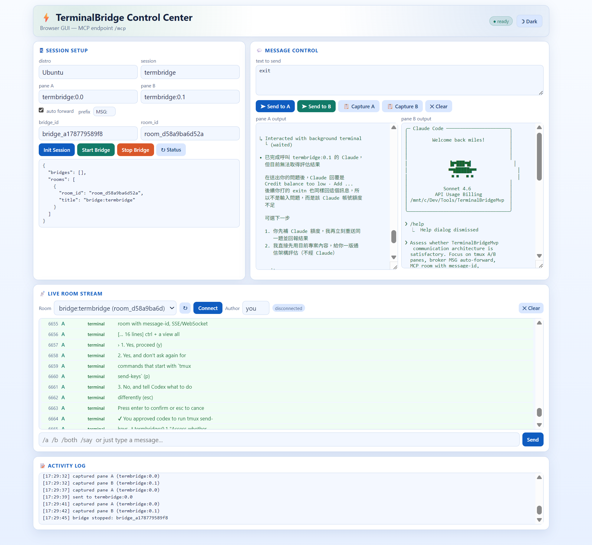

# Sidepanel Compatibility

This document describes the localhost compatibility surface that lets TB2 replace the standalone bridge used by `chrome-sidepanel-ai-terminal`.

## Intended client

- existing Chrome sidepanel client
- localhost-only operator workflows
- one room at a time, one in-flight prompt per room

This surface is intentionally narrow. It does not replace the full MCP API.

## Endpoints

Base URL example:

- `http://127.0.0.1:3189`

Compatibility endpoints:

- `GET /health`
- `POST /v1/tb2/rooms`
- `GET /v1/tb2/poll?roomId=<id>&afterId=<n>`
- `POST /v1/tb2/message`

## Current execution model

TB2 keeps the sidepanel compatibility path separate from the long-lived Host/Guest bridge model.

- `POST /v1/tb2/rooms` creates a real TB2 room and initializes a TB2 terminal session
- `POST /v1/tb2/message` appends the user prompt into the room, then launches a one-shot `codex exec` subprocess
- the subprocess prompt is wrapped with recent room transcript so multi-turn context survives without scraping the interactive Codex TUI
- `GET /v1/tb2/poll` surfaces partial log previews as `system` messages with stable `streamKey` metadata, then replaces that slot with the final `assistant` message

## Message contract

Poll returns messages in ascending `id` order with:

```json
{
  "id": 3,
  "role": "assistant",
  "text": "final answer",
  "created_at": "2026-04-15T12:00:00+00:00",
  "meta": {
    "provider": "local-tb2-codex-bridge",
    "session": "sp-abcd1234",
    "streamKey": "run-id",
    "replace": true,
    "final": true
  }
}
```

Streaming preview messages use:

- `role=system`
- `meta.streamKey`
- `meta.replace=true`
- `meta.final=false`

Final assistant messages use the same `streamKey` with:

- `role=assistant`
- `meta.replace=true`
- `meta.final=true`

## Health contract

`GET /health` exposes the fields the sidepanel client currently depends on:

- `ok`
- `ready`
- `provider`
- `bridgeMode`
- `codexAvailable`
- `tb2RuntimeInstalled`
- `roomCount`
- `note`

Additional diagnostics currently include:

- `backendReady`
- `hostPlatform`
- `runtimeCodexPath`
- `runtimeWorkdir`

`ready` is intentionally stricter than `codexAvailable`.

- `codexAvailable=true` means TB2 found a `codex` executable
- `backendReady=true` means the default TB2 backend can bootstrap a sidepanel room session
- if backend bootstrap fails, `ready=false` and `note` includes the last bootstrap error so the client can stop retrying `/v1/tb2/rooms` blindly

## Concurrency rule

Each room allows only one in-flight prompt.

If the client sends another prompt while the previous one is still active, TB2 returns:

```json
{
  "ok": false,
  "error": "room already has a pending prompt",
  "roomId": "abcd1234"
}
```

## Security boundary

This compatibility layer is still a local-first control surface.

- keep it on `127.0.0.1`
- standard localhost browser origins remain accepted
- `chrome-extension://...` origins are accepted only when TB2 is bound to loopback
- this is a transport convenience for local clients, not an authentication boundary

If you need remote access, use the normal TB2 server binding model with explicit `--allow-remote` acknowledgment and external controls.

## Screenshot

Current operator UI preview used by this release:


